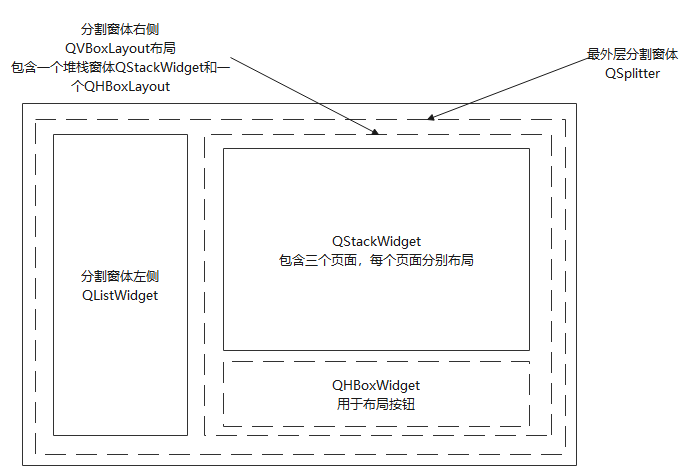
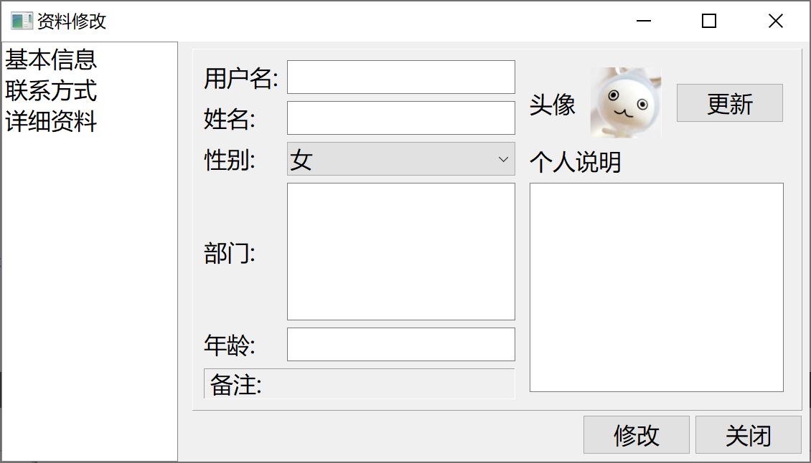
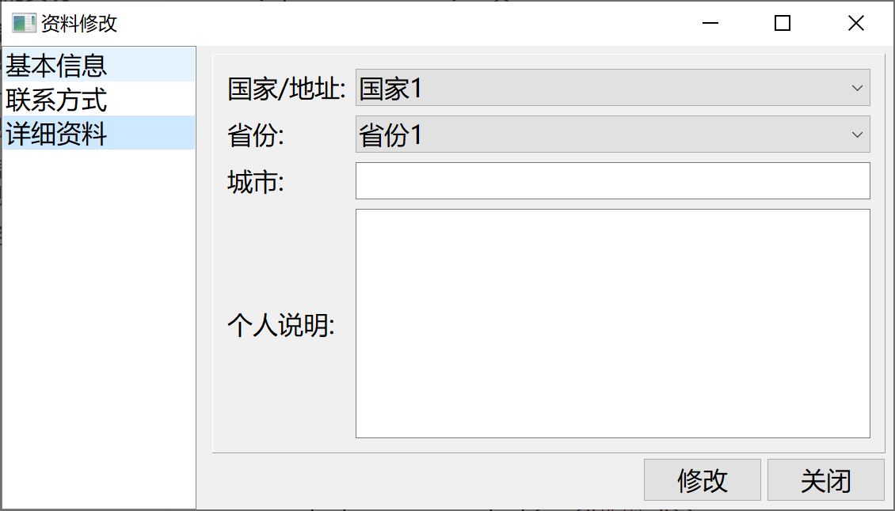

[TOC]


更多参见
[QT基础与实例应用目录](https://blog.csdn.net/leacock1991/article/details/118662440)

### 代码链接

GitHub链接 ： [LayoutExample](https://github.com/lichangke/QT/tree/main/CodeDemo/CH3/CH305/LayoutExample)

### 布局介绍

最外层使用一个分割窗体`QSplitter`，其左侧为一个`QListWidget`，右侧是一个`QVBoxLayout`布局，此布局包含一个堆栈窗体`QStackWidget`和一个`QHBoxWidget`用于布局按钮，堆栈窗体包含三个页面。整体布局如下图。





### 导航页的实现

导航页为上图`QSplitter`的右侧部分，包含 三个页面对象、两个按钮，一个堆栈窗体对象。

**头文件：**

```cpp
class Content : public QFrame
{
    Q_OBJECT
    // 包含 三个页面对象、两个按钮，一个堆栈窗体对象
public:
    Content(QWidget *parent = nullptr);
    ~Content();
    // 一个堆栈窗体对象
    QStackedWidget *stack;
private:
    // 整体布局
    QVBoxLayout *rightMainLayout;
    // 三个页面对象
    BaseInfo *baseInfo;
    Contact *contact;
    Detail *detail;
    // 两个按钮
    QPushButton *modifyBtn;
    QPushButton *closeBtn;
    QHBoxLayout *btnLayout;  // 按钮布局
};
```


**Cpp文件：**

```cpp
Content::Content(QWidget *parent)
    : QFrame(parent)
{
    // 创建 QStackedWidget
    stack = new QStackedWidget(this);
    stack->setFrameStyle(QFrame::Panel|QFrame::Raised); // 设置风格
    // 向QStackedWidget中插入页面，按顺序插入
    baseInfo = new BaseInfo();
    contact = new Contact();
    detail = new Detail();
    stack->addWidget(baseInfo);
    stack->addWidget(contact);
    stack->addWidget(detail);
    // 创建两按钮
    modifyBtn = new QPushButton(tr("修改"));
    closeBtn = new QPushButton(tr("关闭"));
    // 按钮布局
    btnLayout = new QHBoxLayout;
    // 加入 空间间隔 占位符，使两个按钮靠右对齐
    btnLayout->addStretch();
    btnLayout->addWidget(modifyBtn);
    btnLayout->addWidget(closeBtn);
    // 整体布局
    rightMainLayout = new QVBoxLayout(this);
    rightMainLayout->setMargin(10);
    rightMainLayout->setSpacing(6);
    rightMainLayout->addWidget(stack);
    rightMainLayout->addLayout(btnLayout);
}
```


### 基本信息页面的实现





导航页中`baseInfo`对象,参见[QT基础之基本布局QLayout](https://blog.csdn.net/leacock1991/article/details/118947828) 或者 [**QT基础之基本布局QLayout.md**](https://github.com/lichangke/QT/blob/main/QT%E5%9F%BA%E7%A1%80%E4%B9%8B%E5%9F%BA%E6%9C%AC%E5%B8%83%E5%B1%80QLayout.md) 

**头文件**

```cpp
class BaseInfo : public QWidget
{
    Q_OBJECT
public:
    explicit BaseInfo(QWidget *parent = nullptr);

signals:
private:

    // LeftLayout 设置函数
    void LeftLayoutSetting();
    // RightLayout 设置函数
    void RightLayoutSetting();
    // MainLayout 设置函数
    void MainLayoutSetting();

    // LeftLayout
    QLabel *UserNameLabel;// 用户名
    QLabel *NameLabel;// 姓名
    QLabel *SexLabel;// 性别
    QLabel *DepartmentLabel;// 部门
    QLabel *AgeLabel;// 年龄
    QLabel *NoteLabel;// 备注
    QLineEdit * UserNameLineEdit;
    QLineEdit *NameLineEdit;
    QComboBox *SexComboBox;
    QTextEdit *DepartmentTextEdit;
    QLineEdit *AgeLineEdit;
    QGridLayout *LeftLayout; //整个 左侧 网格布局

    // RightLayout
    QLabel *HeadLabel; // 头像
    QLabel *HeadIconLabel; // 头像图标
    QPushButton *UpdateHeadBtn; // 头像更新按钮
    QHBoxLayout *RightTopLayout; // 头像 这部分 水平布局
    QLabel *PersonalInfoLabel; // 个人说明
    QTextEdit *PersonalInfoTextEdit;
    QVBoxLayout *RightLayout; //整个 右侧 垂直布局

    // MainLayout
    QGridLayout *MainLayout; //整个 所有 网格布局
};
```

**Cpp文件**

```cpp
BaseInfo::BaseInfo(QWidget *parent) : QWidget(parent)
{
    setWindowTitle(tr("QT基础之基本布局QLayout"));
    LeftLayoutSetting();
    RightLayoutSetting();
    MainLayoutSetting();
}


void BaseInfo::LeftLayoutSetting()
{
    //左侧
    UserNameLabel = new QLabel(tr("用户名:"));
    UserNameLineEdit = new QLineEdit();

    NameLabel = new QLabel(tr("姓名:"));
    NameLineEdit = new QLineEdit();

    SexLabel = new QLabel(tr("性别:"));
    SexComboBox = new QComboBox();
    SexComboBox->addItem(tr("女"));
    SexComboBox->addItem(tr("男"));

    DepartmentLabel = new QLabel(tr("部门:"));
    DepartmentTextEdit = new QTextEdit();

    AgeLabel = new QLabel(tr("年龄:"));
    AgeLineEdit = new QLineEdit();

    NoteLabel = new QLabel(tr("备注:"));
    // 设置控件的风格，有形状和阴影两项配合设定
    // 形状: NoFrame Box Panel WinPanel HLine VLine StyledPanel 六种
    // 阴影: Plain Raised Sunken 三种
    NoteLabel->setFrameStyle(QFrame::Panel|QFrame::Sunken);

    LeftLayout = new QGridLayout(); // 由于 不是主布局器 不用指定父窗口

    LeftLayout->addWidget(UserNameLabel,0,0);
    LeftLayout->addWidget(UserNameLineEdit,0,1);

    LeftLayout->addWidget(NameLabel,1,0);
    LeftLayout->addWidget(NameLineEdit,1,1);

    LeftLayout->addWidget(SexLabel,2,0);
    LeftLayout->addWidget(SexComboBox,2,1);

    LeftLayout->addWidget(DepartmentLabel,3,0);
    LeftLayout->addWidget(DepartmentTextEdit,3,1);

    LeftLayout->addWidget(AgeLabel,4,0);
    LeftLayout->addWidget(AgeLineEdit,4,1);

    LeftLayout->addWidget(NoteLabel,5,0,1,2);
    // 设置 列的 拉伸系数，对话框框架大小改变，两列的比例不变 这里 1：3
    LeftLayout->setColumnStretch(0,1);
    LeftLayout->setColumnStretch(1,3);
}
void BaseInfo::RightLayoutSetting()
{
    HeadLabel = new QLabel(tr("头像"));
    HeadIconLabel = new QLabel();
    QPixmap icon(":/icon/head.png");
    HeadIconLabel->setPixmap(icon);
    HeadIconLabel->setFixedSize(100, 100);
    //HeadIconLabel->resize(icon.width(),icon.height());
    // setScaledContents按比例缩放图片达到理想的效果
    HeadIconLabel->setScaledContents(true);
    UpdateHeadBtn = new QPushButton(tr("更新"));
    // 右上 头像部分布局
    RightTopLayout = new QHBoxLayout();
    RightTopLayout->addWidget(HeadLabel);
    RightTopLayout->addWidget(HeadIconLabel);
    RightTopLayout->addWidget(UpdateHeadBtn);
    RightTopLayout->setSpacing(20); // 控件之间的间距

    PersonalInfoLabel = new QLabel(tr("个人说明"));
    PersonalInfoTextEdit = new QTextEdit();

    RightLayout = new QVBoxLayout(); // 由于 不是主布局器 不用指定父窗口

    RightLayout->addLayout(RightTopLayout); // 子布局
    RightLayout->addWidget(PersonalInfoLabel);
    RightLayout->addWidget(PersonalInfoTextEdit);
    RightLayout->setMargin(10); // 控件与窗体的边距

}

void BaseInfo::MainLayoutSetting()
{
    MainLayout = new QGridLayout(this);// 主布局 父窗口指定为this
    MainLayout->setMargin(15); // 控件与窗体的边距
    MainLayout->setSpacing(10); // 控件之间的间距
    MainLayout->addLayout(LeftLayout,0,0);
    MainLayout->addLayout(RightLayout,0,1);

    // 保存布局的调整大小模式
    MainLayout->setSizeConstraint(QLayout::SetFixedSize);
}
```

`setSizeConstraint`此属性保存布局的调整大小模式看下表，枚举 `QLayout::SizeConstraint` 可能的值是:


### 联系方式页面的实现


**头文件**

```cpp
class Contact : public QWidget
{
    Q_OBJECT
public:
    explicit Contact(QWidget *parent = nullptr);

signals:

private:
    QLabel *emailLabel;
    QLineEdit *emailLineEdit;
    QLabel *addrLabel;
    QLineEdit *addrLineEdit;
    QLabel *zipCodeLabel;
    QLineEdit *zipCodeLineEdit;
    QLabel *mobileTeleLabel;
    QLineEdit *mobileTeleLineEdit;
    QCheckBox *mobileTeleCheckBox;
    QLabel *officePhoneLabel;
    QLineEdit *officePhoneEdit;

    QGridLayout *mainLayout;
};
```


**Cpp文件**

```cpp
Contact::Contact(QWidget *parent) : QWidget(parent)
{
    emailLabel = new QLabel(tr("电子邮件:"));
    emailLineEdit = new QLineEdit;
    addrLabel = new QLabel(tr("联系地址:"));
    addrLineEdit = new QLineEdit;
    zipCodeLabel = new QLabel(tr("邮政编码:"));
    zipCodeLineEdit = new QLineEdit;
    mobileTeleLabel = new QLabel(tr("移动电话:"));
    mobileTeleLineEdit = new QLineEdit;
    mobileTeleCheckBox = new QCheckBox(tr("接收短信"));
    officePhoneLabel = new QLabel(tr("办公电话:"));
    officePhoneEdit = new QLineEdit;

    mainLayout->setMargin(15);
    mainLayout->setSpacing(10);
    mainLayout->addWidget(emailLabel,0,0);
    mainLayout->addWidget(emailLineEdit,0,1);
    mainLayout->addWidget(addrLabel,1,0);
    mainLayout->addWidget(addrLineEdit,1,1);
    mainLayout->addWidget(zipCodeLabel,2,0);
    mainLayout->addWidget(zipCodeLineEdit,2,1);
    mainLayout->addWidget(mobileTeleLabel,3,0);
    mainLayout->addWidget(mobileTeleLineEdit,3,1);
    mainLayout->addWidget(mobileTeleCheckBox,3,2);
    mainLayout->addWidget(officePhoneLabel,4,0);
    mainLayout->addWidget(officePhoneEdit,4,1);
    // 保存布局的调整大小模式
    mainLayout->setSizeConstraint(QLayout::SetFixedSize);
}
```


### 详细信息页面的实现



**头文件**

```cpp
class Detail : public QWidget
{
    Q_OBJECT
public:
    explicit Detail(QWidget *parent = nullptr);

signals:

private:
    QLabel *nationalLabel;
    QComboBox *nationalComboBox;
    QLabel *provinceLabel;
    QComboBox *provinceComboBox;
    QLabel *cityLabel;
    QLineEdit *cityLineEdit;
    QLabel *introductLabel;
    QTextEdit *introductLineEdit;

    QGridLayout *mainLayout;
};
```

**Cpp文件**

```cpp
Detail::Detail(QWidget *parent) : QWidget(parent)
{
    nationalLabel = new QLabel(tr("国家/地址:"));
    nationalComboBox = new QComboBox;
    nationalComboBox->insertItem(0,tr("国家1"));
    nationalComboBox->insertItem(1,tr("国家2"));
    nationalComboBox->insertItem(2,tr("国家3"));

    provinceLabel = new QLabel(tr("省份:"));
    provinceComboBox = new QComboBox;
    provinceComboBox->insertItem(0,tr("省份1"));
    provinceComboBox->insertItem(1,tr("省份2"));
    provinceComboBox->insertItem(2,tr("省份3"));

    cityLabel = new QLabel(tr("城市:"));
    cityLineEdit = new QLineEdit;

    introductLabel = new QLabel(tr("个人说明:"));
    introductLineEdit = new QTextEdit;

    mainLayout = new QGridLayout(this);
    mainLayout->addWidget(nationalLabel,0,0);
    mainLayout->addWidget(nationalComboBox,0,1);
    mainLayout->addWidget(provinceLabel,1,0);
    mainLayout->addWidget(provinceComboBox,1,1);
    mainLayout->addWidget(cityLabel,2,0);
    mainLayout->addWidget(cityLineEdit,2,1);
    mainLayout->addWidget(introductLabel,3,0);
    mainLayout->addWidget(introductLineEdit,3,1);
}
```


### **main函数**  

**Cpp文件**

```cpp
int main(int argc, char *argv[])
{
    QApplication a(argc, argv);
    // 设置字体
    QFont font("微软雅黑",12);
    a.setFont(font);
    // 分割窗体
    QSplitter *splitter = new QSplitter(Qt::Horizontal);
    splitter->setOpaqueResize(true); // 拖拉分割线的时候，窗口是否实时显示
    QListWidget *list = new QListWidget;
    splitter->addWidget(list);
    list->insertItem(0,QObject::tr("基本信息"));
    list->insertItem(1,QObject::tr("联系方式"));
    list->insertItem(2,QObject::tr("详细资料"));
    Content *content= new Content;
    splitter->addWidget(content);
    QObject::connect(list,SIGNAL(currentRowChanged(int)),content->stack,
                     SLOT(setCurrentIndex(int)));

    splitter->setWindowTitle(QObject::tr("资料修改"));
    splitter->setMinimumSize(splitter->minimumSize());
    splitter->setMaximumSize(splitter->maximumSize());
    splitter->show();

//    Content w;
//    w.show();
    return a.exec();
}
```


注按钮消息未处理，数据存储未处理，可自行添加


希望我的文章对于大家有帮助，由于个人能力的局限性，文中可能存在一些问题，欢迎指正、补充！

