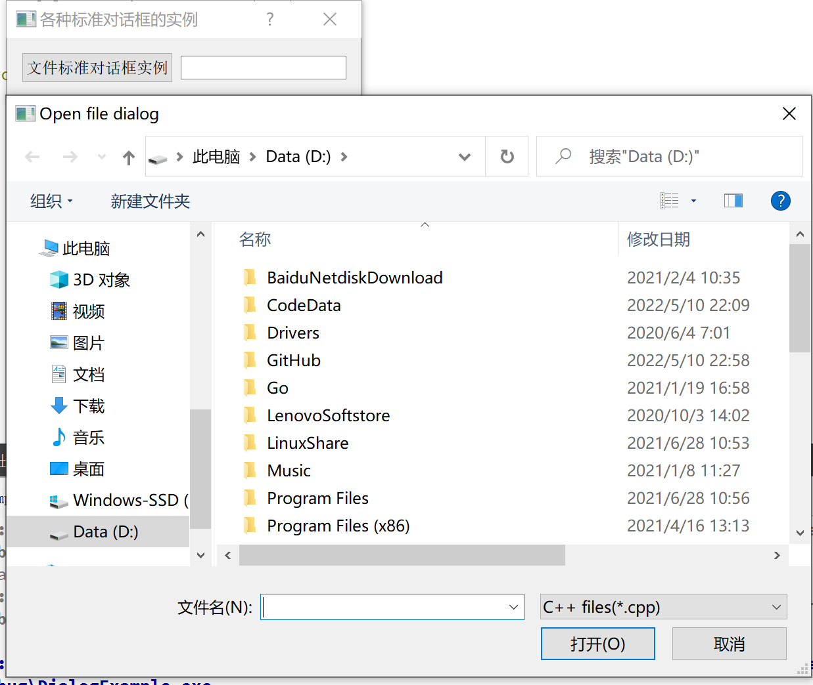
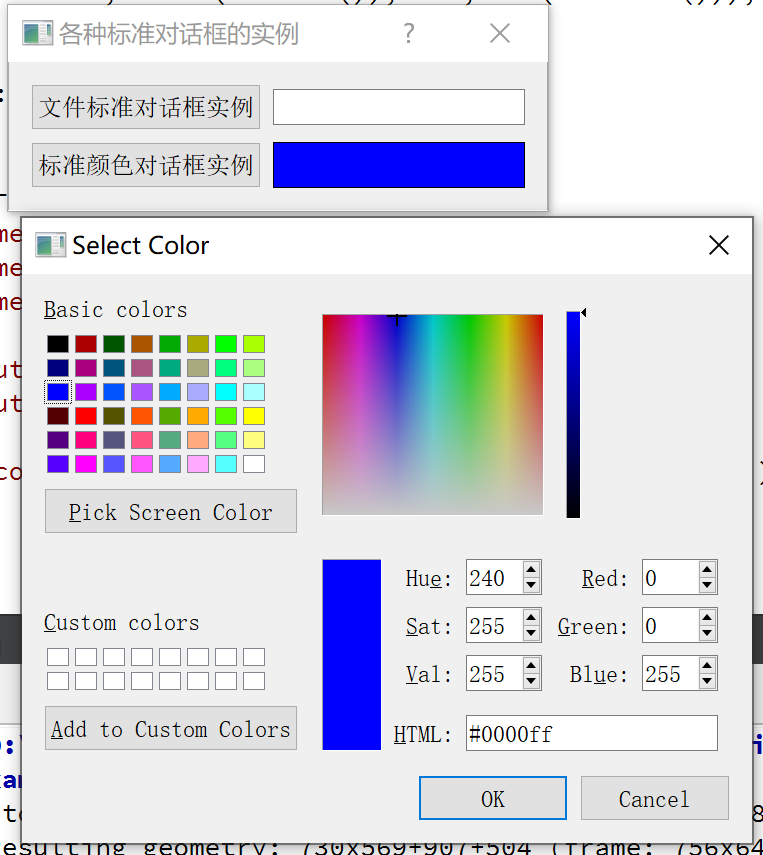
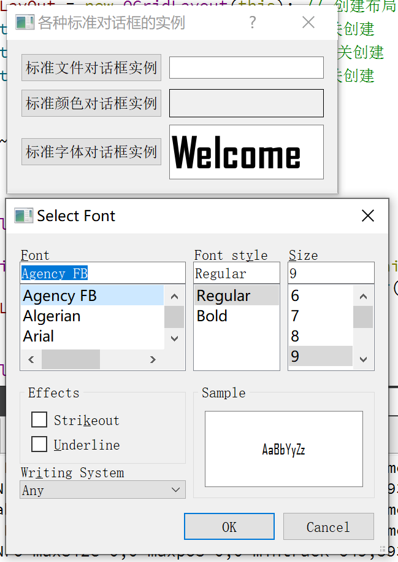
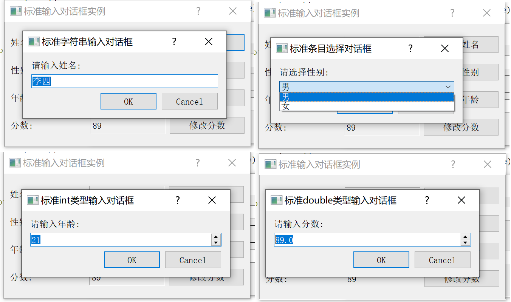

更多参见
[QT基础与实例应用目录](https://blog.csdn.net/leacock1991/article/details/118662440)


### 介绍

介绍标准文件对话框(QFileDialog)、标准颜色对话框(QColorDialog)、标准字体对话框(QFontDialog)、标准输入对话框(QInputDialog)以及标准消息对话框(QMessageDialog)的使用


### 代码链接

GitHub链接 ： [DialogExample](https://github.com/lichangke/QT/tree/main/CodeDemo/CH4/CH401/DialogExample)

### 标准文件对话框(QFileDialog)



#### 代码简介

**头文件：**

```cpp
private slots:
    void showFile(); // fileBtn 点击触发
private:
    QGridLayout *mainLayOut; // 网格布局布局    
    // 标准文件对话框成员变量
    QPushButton *fileBtn; // 点击按钮弹出 标准文件对话框
    QLineEdit *fileLineEdit; // 显示标准对话框选择的文件
```

**cpp文件：**

```cpp
void Dialog::showFile()
{
    QString str = QFileDialog::getOpenFileName(this,"Open file dialog","D:\\",
                                               tr("C++ files(*.cpp);;C files(*.c);;Head files(*.h)"));
    fileLineEdit->setText(str);
}

void Dialog::createQFileDialog()
{
    // 创建组件
    fileBtn = new QPushButton;
    fileBtn->setText(tr("文件标准对话框实例"));
    fileLineEdit = new QLineEdit;

    // 布局
    mainLayOut->addWidget(fileBtn,0,0);
    mainLayOut->addWidget(fileLineEdit,0,1);

    // 关联事件
    connect(fileBtn,SIGNAL(clicked()),this,SLOT(showFile()));
}
```

**`getOpenFileName` 函数介绍**

```cpp
QString QFileDialog::getOpenFileName
(
QWidget *parent = nullptr,	// 父窗口
const QString &caption = QString(),	// 标题
const QString &dir = QString(), 	// 默认目录，若带文件名，则此文件为默认选中的文件
const QString &filter = QString(),	// 文件类型过滤，多种过滤器之间用;;隔开
QString *selectedFilter = nullptr,	// 用户选择的过滤器通过此返回
QFileDialog::Options options = Options()	// 选择显示文件名的格式，默认同时显示目录和文件名
)
```

#### QFileDialog类常用静态函数

| 静态函数             | 函数说明                     |
| :------------------- | :--------------------------- |
| getOpenFileName      | 获取用户选择的文件名         |
| getOpenFileNames     | 获取用户选择的文件名列表     |
| getSaveFileName      | 获取用户保存的文件名         |
| getExistingDirectory | 获取用户选择的已存在的目录名 |


### 标准颜色对话框(QColorDialog)




#### 代码简介

**头文件：**

```cpp
private slots:
    void showColor(); // colorBtn
private:
    // 标准颜色对话框成员变量
    QPushButton *colorBtn;
    QFrame *colorFrame; // 显示选择的颜色
```

**cpp文件：**

```cpp
void Dialog::showColor()
{
    QColor color = QColorDialog::getColor(Qt::blue);
    if(color.isValid()){
        colorFrame->setPalette(QPalette(color));
    }
}
void Dialog::createQColorDialog()
{
    colorBtn = new QPushButton;
    colorBtn->setText(tr("标准颜色对话框实例"));
    colorFrame = new QFrame;
    colorFrame->setFrameShape(QFrame::Box);
    colorFrame->setAutoFillBackground(true);

    mainLayOut->addWidget(colorBtn,1,0);
    mainLayOut->addWidget(colorFrame,1,1);

    connect(colorBtn,SIGNAL(clicked()),this,SLOT(showColor()));
}
```

**`getColor` 函数介绍**

```cpp
QColor QColorDialog::getColor
(
const QColor &initial = Qt::white,	// 默认选中颜色
 QWidget *parent = nullptr,	// 父窗口
 const QString &title = QString(), // 窗口 title ，如果未指定，则为Select Color
 QColorDialog::ColorDialogOptions options = ColorDialogOptions() // 允许自定义对话框
 )
```

#### QColorDialog类常用静态函数

| 静态函数 | 函数说明             |
| :------- | :------------------- |
| getColor | 获取用户选择的颜色值 |


### 标准字体对话框(QFontDialog)




#### 代码简介

**头文件：**

```cpp
private slots:
    void showFont(); // fontBtn
private:
    // 标准字体对话框成员变量
    QPushButton *fontBtn;
    QLineEdit *fontLineEdit;
```

**cpp文件：**

```cpp
void Dialog::showFont()
{
    bool isOK = false;
    QFont font = QFontDialog::getFont(&isOK);
    if(isOK){
        fontLineEdit->setFont(font);
    }
}
void Dialog::createQFontDialog()
{
    fontBtn = new QPushButton;
    fontBtn->setText(tr("标准字体对话框实例"));
    fontLineEdit = new QLineEdit;
    fontLineEdit->setText(tr("Welcome"));

    mainLayOut->addWidget(fontBtn,2,0);
    mainLayOut->addWidget(fontLineEdit,2,1);

    connect(fontBtn,SIGNAL(clicked()),this,SLOT(showFont()));
}
```

**`getFont` 函数介绍**

```cpp
QFont QFontDialog::getFont
(
bool *ok,	// 用户点击ok，设置为true，并返回用户选择字体，否则设置为false，返回默认字体
QWidget *parent = nullptr	// 父窗口
)
```

#### QFontDialog类常用静态函数

| 静态函数 | 函数说明           |
| :------- | :----------------- |
| getFont  | 获取用户选择的字体 |


### 标准输入对话框(QInputDialog)

演示了标准输入对话框提供的四种数据类型输入，包括字符串、下拉列表、int数据类型和double数据类型。

这里自定义了一个InputDlg用于主界面按钮弹框显示，以上四种类型放在InputDlg中。点击不同的修改按钮弹出不同的类型标准输入对话框


#### 主界面代码简介

**头文件：**

```cpp
private slots:
    void showInputDlg(); // inputBtn
private:
    // 标准输入对话框
    QPushButton *inputBtn;
    InputDlg *inputDlg;
```

**cpp文件：**

```cpp
void Dialog::showInputDlg()
{
    inputDlg = new InputDlg(this);
    inputDlg->show();
}
void Dialog::createQInputDialog()
{
    inputBtn = new QPushButton;
    inputBtn->setText(tr("标准输入对话框实例"));

    mainLayOut->addWidget(inputBtn,3,0);
    connect(inputBtn,SIGNAL(clicked()),this,SLOT(showInputDlg()));
}
```


#### 自定义InputDlg

点击不同的修改按钮弹出不同的输入对话框



##### **头文件：**

```cpp
#define INPUTDLG_H

#include <QDialog>
#include <QGridLayout> // 用于布局设计
#include <QPushButton>
#include <QLabel>

class InputDlg : public QDialog
{
    Q_OBJECT // 用于signal和slot机制的使用
public:
    InputDlg(QWidget *parent = nullptr);
private slots:
    void changeName();  // 演示字符串类型 nameBtn
    void changeSex();   // 演示下拉列表
    void changeAge();   // 演示int数据类型
    void changeScore(); // 演示double数据类型
private:
    QGridLayout *mainLayout;
    // 用于 标准输入对话框 演示字符串类型
    QLabel *nameLabel1; // 显示 姓名
    QLabel *nameLabel2; // 显示 具体名字 由按钮弹框修改，标准输入对话框的字符串类型
    QPushButton *nameBtn; // 修改 姓名的按钮

    // 用于 标准输入对话框 演示下拉列表
    QLabel *sexLabel1;
    QLabel *sexLabel2;
    QPushButton *sexBtn;

    // 用于 标准输入对话框 演示int数据类型
    QLabel *ageLabel1;
    QLabel *ageLabel2;
    QPushButton *ageBtn;

    // 用于 标准输入对话框 演示double数据类型
    QLabel *scoreLabel1;
    QLabel *scoreLabel2;
    QPushButton *scoreBtn;
};

#endif // INPUTDLG_H
```

**cpp文件：**

```cpp
#include "inputdlg.h"

#include <QInputDialog>

InputDlg::InputDlg(QWidget *parent)
    :QDialog(parent)
{
    setWindowTitle(tr("标准输入对话框实例"));

    nameLabel1 = new QLabel;
    nameLabel1->setText(tr("姓名:"));
    nameLabel2 = new QLabel;
    nameLabel2->setText(tr("李四"));
    nameLabel2->setFrameStyle(QFrame::Panel|QFrame::Sunken);
    nameBtn = new QPushButton;
    nameBtn->setText(tr("修改姓名"));

    sexLabel1 = new QLabel;
    sexLabel1->setText(tr("性别:"));
    sexLabel2 = new QLabel;
    sexLabel2->setText(tr("男"));
    sexLabel2->setFrameStyle(QFrame::Panel|QFrame::Sunken);
    sexBtn = new QPushButton;
    sexBtn->setText(tr("修改性别"));

    ageLabel1 = new QLabel;
    ageLabel1->setText(tr("年龄:"));
    ageLabel2 = new QLabel;
    ageLabel2->setText(tr("21"));
    ageLabel2->setFrameStyle(QFrame::Panel|QFrame::Sunken);
    ageBtn = new QPushButton;
    ageBtn->setText(tr("修改年龄"));

    scoreLabel1 = new QLabel;
    scoreLabel1->setText(tr("分数:"));
    scoreLabel2 = new QLabel;
    scoreLabel2->setText(tr("89"));
    scoreLabel2->setFrameStyle(QFrame::Panel|QFrame::Sunken);
    scoreBtn = new QPushButton;
    scoreBtn->setText(tr("修改分数"));

    mainLayout = new QGridLayout(this);
    mainLayout->addWidget(nameLabel1,0,0);
    mainLayout->addWidget(nameLabel2,0,1);
    mainLayout->addWidget(nameBtn,0,2);

    mainLayout->addWidget(sexLabel1,1,0);
    mainLayout->addWidget(sexLabel2,1,1);
    mainLayout->addWidget(sexBtn,1,2);

    mainLayout->addWidget(ageLabel1,2,0);
    mainLayout->addWidget(ageLabel2,2,1);
    mainLayout->addWidget(ageBtn,2,2);

    mainLayout->addWidget(scoreLabel1,3,0);
    mainLayout->addWidget(scoreLabel2,3,1);
    mainLayout->addWidget(scoreBtn,3,2);
    mainLayout->setSpacing(10);
    mainLayout->setMargin(15);

    connect(nameBtn,SIGNAL(clicked()),this,SLOT(changeName()));
    connect(sexBtn,SIGNAL(clicked()),this,SLOT(changeSex()));
    connect(ageBtn,SIGNAL(clicked()),this,SLOT(changeAge()));
    connect(scoreBtn,SIGNAL(clicked()),this,SLOT(changeScore()));
}

void InputDlg::changeName()
{
    bool isOk = false;
    QString text = QInputDialog::getText(this,tr("标准字符串输入对话框"),
                                         tr("请输入姓名:"),QLineEdit::Normal,nameLabel2->text(),&isOk);
    if(isOk && !text.isEmpty()){
        nameLabel2->setText(text);
    }
}

void InputDlg::changeSex()
{
    QStringList sexItems;
    sexItems.push_back(tr("男"));
    sexItems.push_back(tr("女"));
    bool isOk = false;
    QString sexItem = QInputDialog::getItem(this,tr("标准条目选择对话框"),
                                         tr("请选择性别:"),sexItems,0,false,&isOk);
    if(isOk && !sexItem.isEmpty()){
        sexLabel2->setText(sexItem);
    }
}

void InputDlg::changeAge()
{
    bool isOk = false;
    int age = QInputDialog::getInt(this,tr("标准int类型输入对话框"),
                                         tr("请输入年龄:"),ageLabel2->text().toInt(&isOk),0,100,1,&isOk);
    if(isOk){
        ageLabel2->setText(QString(tr("%1")).arg(age));
    }
}

void InputDlg::changeScore()
{
    bool isOk = false;
    double score = QInputDialog::getDouble(this,tr("标准double类型输入对话框"),
                                         tr("请输入分数:"),scoreLabel2->text().toDouble(&isOk),0,100,1,&isOk);
    if(isOk){
        scoreLabel2->setText(QString(tr("%1")).arg(score));
    }
}
```


静态函数 `QInputDialog::getText`、`QInputDialog::getItem`、`QInputDialog::getInt`、`QInputDialog::getDouble` 的定义可以参看QT的帮助手册


### 标准消息对话框(QMessageBox)

演示了常用的消息对话框包括Question消息框、Information消息框、Warning消息框、Critical消息框、About(关于)消息框、About(关于)Qt消息框以及Custom(自定义)消息框。

这里自定义了一个MsgBoxDlg类用于主界面按钮弹框显示，以上消息框放在MsgBoxDlg中。点击不同的修改按钮弹出不同的消息框。


#### 主界面代码简介

**头文件：**

```cpp
private slots:
    void showMsgDlg(); // msgBtn
private:
    //消息对话框
    QPushButton *msgBtn;
    MsgBoxDlg *msgDlg;
```

**cpp文件：**

```cpp
void Dialog::showMsgDlg()
{
    msgDlg = new MsgBoxDlg(this);
    msgDlg->show();
}
void Dialog::createQMessageDialog()
{
    msgBtn = new QPushButton;
    msgBtn->setText(tr("标准消息对话框实例"));

    mainLayOut->addWidget(msgBtn,3,1);
    connect(msgBtn,SIGNAL(clicked()),this,SLOT(showMsgDlg()));
}
```

#### 自定义MsgBoxDlg

点击不同的按钮弹出不同的消息框


**头文件：**

```cpp
#include <QDialog>
#include <QGridLayout> // 用于布局设计
#include <QPushButton>
#include <QLabel>

class MsgBoxDlg : public QDialog
{
    Q_OBJECT
public:
    MsgBoxDlg(QWidget *parent = nullptr);
private slots:
    void showQuestionMsg(); // questionBtn
    void showInformationMsg(); // informationBtn
    void showWarningMsg(); // warningBtn
    void showCriticalMsg(); // criticalBtn
    void showAboutMsg(); // aboutBtn
    void showAboutQtMsg(); // aboutQtBtn
private:
    QGridLayout *mainLayout;
    QLabel *label; // 显示选择了什么消息框
    QPushButton *questionBtn;
    QPushButton *informationBtn;
    QPushButton *warningBtn;
    QPushButton *criticalBtn;
    QPushButton *aboutBtn;
    QPushButton *aboutQtBtn;
};
```

**cpp文件**

```cpp
MsgBoxDlg::MsgBoxDlg(QWidget *parent)
    :QDialog(parent)
{
    setWindowTitle(tr("标准消息对话框实例"));
    label = new QLabel;
    label->setText(tr("请选择一种消息框"));

    questionBtn = new QPushButton;
    questionBtn->setText(tr("QuestionMsg"));
    informationBtn = new QPushButton;
    informationBtn->setText(tr("InformationMsg"));
    warningBtn = new QPushButton;
    warningBtn->setText(tr("WarningMsg"));
    criticalBtn = new QPushButton;
    criticalBtn->setText(tr("CriticalMsg"));
    aboutBtn = new QPushButton;
    aboutBtn->setText(tr("AboutMsg"));
    aboutQtBtn = new QPushButton;
    aboutQtBtn->setText(tr("AboutQtMsg"));

    mainLayout = new QGridLayout(this);
    mainLayout->addWidget(label,0,0,1,2);
    mainLayout->addWidget(questionBtn,1,0);
    mainLayout->addWidget(informationBtn,1,1);
    mainLayout->addWidget(warningBtn,2,0);
    mainLayout->addWidget(criticalBtn,2,1);
    mainLayout->addWidget(aboutBtn,3,0);
    mainLayout->addWidget(aboutQtBtn,3,1);

    connect(questionBtn,SIGNAL(clicked()),this,SLOT(showQuestionMsg()));
    connect(informationBtn,SIGNAL(clicked()),this,SLOT(showInformationMsg()));
    connect(warningBtn,SIGNAL(clicked()),this,SLOT(showWarningMsg()));
    connect(criticalBtn,SIGNAL(clicked()),this,SLOT(showCriticalMsg()));
    connect(aboutBtn,SIGNAL(clicked()),this,SLOT(showAboutMsg()));
    connect(aboutQtBtn,SIGNAL(clicked()),this,SLOT(showAboutQtMsg()));
}

void MsgBoxDlg::showQuestionMsg()
{
    label->setText(tr("Question Message Box"));

    auto ret = QMessageBox::question(this,tr("Question消息框"),
                tr("Question消息框显示演示"),
                QMessageBox::Ok|QMessageBox::Cancel,QMessageBox::Ok);

    switch(ret){
    case QMessageBox::Ok:
        label->setText(tr("Question Button/OK"));
        break;
    case QMessageBox::Cancel:
        label->setText(tr("Question Button/Cancel"));
        break;
    default:
        break;
    }
    return;
}

void MsgBoxDlg::showInformationMsg()
{
    label->setText(tr("Information Message Box"));
    QMessageBox::information(this,tr("Information消息框"),
                tr("Information消息框显示演示"));
    return;
}

void MsgBoxDlg::showWarningMsg()
{
    label->setText(tr("Warning Message Box"));

    auto ret = QMessageBox::warning(this,tr("Warning消息框"),
                tr("Warning消息框显示演示"),
                QMessageBox::Save|QMessageBox::Discard|QMessageBox::Cancel,
                QMessageBox::Save);

    switch(ret){
    case QMessageBox::Save:
        label->setText(tr("Warning Button/Save"));
        break;
    case QMessageBox::Discard:
        label->setText(tr("Warning Button/Discard"));
        break;
    case QMessageBox::Cancel:
        label->setText(tr("Warning Button/Cancel"));
        break;
    default:
        break;
    }
    return;
}

void MsgBoxDlg::showCriticalMsg()
{
    label->setText(tr("Critical Message Box"));
    QMessageBox::critical(this,tr("Critical消息框"),
                tr("Information消息框显示演示"));
    return;
}

void MsgBoxDlg::showAboutMsg()
{
    label->setText(tr("About Message Box"));
    QMessageBox::about(this,tr("About消息框"),
                tr("About消息框显示演示"));
    return;
}

void MsgBoxDlg::showAboutQtMsg()
{
    label->setText(tr("AboutQt Message Box"));
    QMessageBox::aboutQt(this,tr("AboutQt消息框"));
    return;
}
```

静态函数 `QMessageBox::question、QMessageBox::information、QMessageBox::warning、QMessageBox::critical、QMessageBox::about、QMessageBox::aboutQt` 的定义可以参看QT的帮助手册

### 自定义消息框


#### 代码简介

**头文件：**

```cpp
private slots:
    void showCustomDlg(); // customBtn
private:
    // 自定义消息框
    QPushButton *customBtn;
    QLabel *label;
```

**cpp文件：**

```cpp
void Dialog::showCustomDlg()
{
    label->setText(tr("Custom Message Box"));
    QMessageBox customMsgBox;
    customMsgBox.setWindowTitle(tr("用户自定义消息框"));
    QPushButton *yesBtn = customMsgBox.addButton(tr("Yes"),QMessageBox::ActionRole); // 自定义按钮，参数为 按钮显示文字，按钮类型
    QPushButton *noBtn = customMsgBox.addButton(tr("no"),QMessageBox::ActionRole);
    QPushButton *cancelBtn = customMsgBox.addButton(QMessageBox::Cancel); // 加入 标准按钮， 按addButton顺序从左到右依次加入
    customMsgBox.setText(tr("这是一个用户自定义消息框"));
    // customMsgBox.setIconPixmap(QPixmap("xx.png")); // 自定义图标
    customMsgBox.exec();
    auto ret = customMsgBox.clickedButton();
    if(ret == yesBtn){
        label->setText(tr("Custom Message Box/Yes"));
    }
    if(ret == noBtn){
        label->setText(tr("Custom Message Box/No"));
    }
    if(ret == cancelBtn){
        label->setText(tr("Custom Message Box/Cancel"));
    }
    return;
}
void Dialog::createCustomDialog()
{
    customBtn = new QPushButton;
    customBtn->setText(tr("用户自定义消息对话框实例"));
    label = new QLabel;
    label->setFrameStyle(QFrame::Panel|QFrame::Sunken);

    mainLayOut->addWidget(customBtn,4,0);
    mainLayOut->addWidget(label,4,1);
    connect(customBtn,SIGNAL(clicked()),this,SLOT(showCustomDlg()));
}
```


希望我的文章对于大家有帮助，由于个人能力的局限性，文中可能存在一些问题，欢迎指正、补充！

